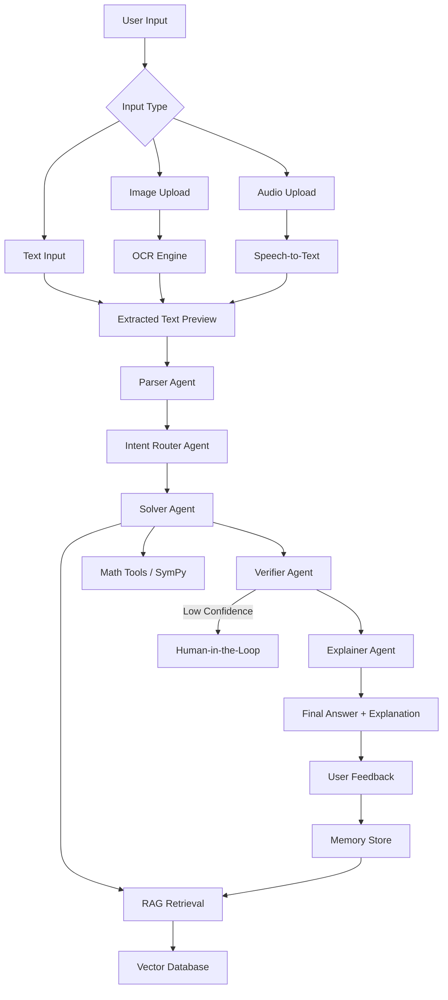

# Multimodal Math Mentor

An **AI-powered tutoring application** that solves **JEE-style math problems** from **text, image, or audio inputs** using a **Retrieval-Augmented Generation (RAG) based multi-agent architecture with Human-in-the-Loop and memory**.

The system extracts the problem, retrieves relevant mathematical knowledge, solves it using reasoning and tools, verifies correctness, and produces **clear step-by-step explanations for students**.

---

# Features

### Multimodal Input

Users can submit math problems through:

* **Text input** (typed question)
* **Image upload** (OCR extraction from textbook/handwritten problems)
* **Audio input** (speech-to-text conversion)

Extracted text is shown to the user for **verification and correction before solving**.

---

### Multi-Agent Pipeline

The system uses a structured **agent-based architecture**:

**Parser Agent**
Cleans OCR/ASR output and converts the question into structured format.

**Intent Router Agent**
Identifies the topic (algebra, probability, calculus) and routes the workflow.

**Solver Agent**
Uses **RAG + mathematical tools (SymPy/Python)** to compute the solution.

**Verifier Agent**
Checks correctness, domain constraints, and logical validity.

**Explainer Agent**
Generates **student-friendly step-by-step explanations**.

---

### Retrieval-Augmented Generation (RAG)

A curated knowledge base of mathematical concepts including:

* formulas and identities
* solution templates
* common mistakes
* mathematical constraints

Pipeline:

Documents → Chunk → Embed → Vector Store → Retrieve Top-K → LLM Reasoning

Retrieved sources are shown in the UI to prevent hallucinated answers.

---

### Human-in-the-Loop (HITL)

Human interaction is triggered when:

* OCR or speech transcription confidence is low
* the parser detects ambiguity
* the verifier is uncertain

Users can **edit extracted text, approve solutions, or provide corrections**.

---

### Memory Layer

The application stores interaction history including:

* original input (text/image/audio)
* parsed problem
* retrieved context
* final answer
* verification results
* user feedback

This memory is reused to **recognize similar problems and reuse solution patterns**.

---

# Architecture



# Tech Stack

| Component       | Technology          |
| --------------- | ------------------- |
| UI              | Streamlit           |
| Backend         | Python              |
| LLM             | llama-3.1-8b-instant|
| Embeddings      | multilingual-e5     |
| Vector Database | Pinecone            |
| OCR             | EasyOCR             |
| Speech-to-Text  | Whisper             |
| Math Tools      | SymPy               |
| Memory          | Neon DB             |

---

# Project Structure

```
multimodal-math-mentor
│
├── app.py
├── agents/
├── rag/
├── memory/
├── utils/
├── data/
├── requirements.txt
├── .env.example
└── README.md
```

---

# Installation

Clone the repository

```
git clone https://github.com/yourusername/multimodal-math-mentor.git
cd multimodal-math-mentor
```

Create virtual environment

```
python -m venv venv
venv\Scripts\activate
```

Install dependencies

```
pip install -r requirements.txt
```

Create `.env` file

```
GROQ_API_KEY=your_api_key
```

Run the application

```
streamlit run app.py
```

Open in browser

```
http://localhost:8501
```

